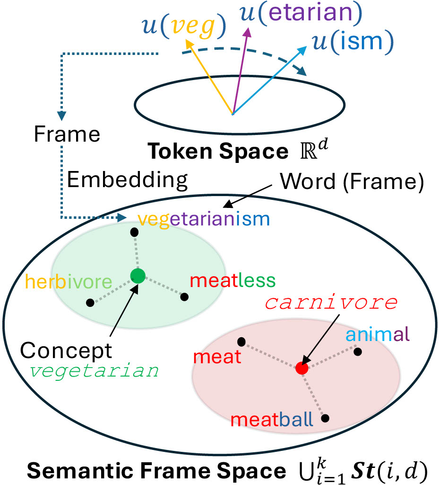

# 🎌 Frame Representation Hypothesis

> **Authors: [Pedro Valois](https://phvv.me/), [Kazuhiro Fukui](https://www.cs.tsukuba.ac.jp/~kfukui/english/indexE.html), [Lincon Souza](https://dblp.org/pid/196/6193.html), [Erica Kido Shimomoto](https://ericashimomoto.github.io)**

The Frame Representation Hypothesis is a robust framework for understanding and controlling LLMs. We use WordNet to generate concepts that can both guide the model text generation and expose biases or vulnerabilities.

[](https://arxiv.org/abs/0)
[](https://github.com/Pedrexus/flag-representation-hypothesis)

<div align="center"></div>
<!-- <div align="center"></div> -->

## 💡 Highlights

- ♻️ **Capable of dealing with multi-token words.**

- 🎧 **Can use OMW 50M word dataset to build 100,000 concepts.**

- 💪 **Tested on Llama 3.1, Gemma 2 and Phi 3 ensuring high-quality responses.**

- 🚀 **Very fast and low memory cost. Able to compute all concepts in less than a second and fit both Llama 3.1 8B Instruct and Concepts in a RTX 4090 GPU.**

## Install

1. Clone this repository.

```shell
git clone https://github.com/Pedrexus/flag-representation-hypothesis
cd flag-representation-hypothesis
```

2. Install packages.

```shell
pip install -U pip
pip install uv
uv sync
```

4. Install `flash-attention`.

```shell
pip install flash-attn --no-build-isolation
```

5. Download Models

Run `01_START_HERE.ipynb` to download all models.

## Quick Start

Each experiment in the paper is in one of the jupyter notebooks starting from 02.

## LICENSE

Our code is released under the MIT License.

## Citation

If you have any questions, please feel free to submit an issue or contact `pedro@cvlab.cs.tsukuba.ac.jp`.

If our work is useful for you, please cite as:

```
@article{valois2025,
  title={Frame Representation Hypothesis: Multi-Token LLM Interpretability and Concept-Guided Text Generation},
  author={Valois, Pedro H. V. and Souza, Lincon and Shimamoto, Erica and Fukui, Kazuhiro},
  journal={TACL},
  year={2025}
}
```

## Star History

<!-- [](https://star-history.com/#Pedrexus/flag-representation-hypothesis&Date) -->
